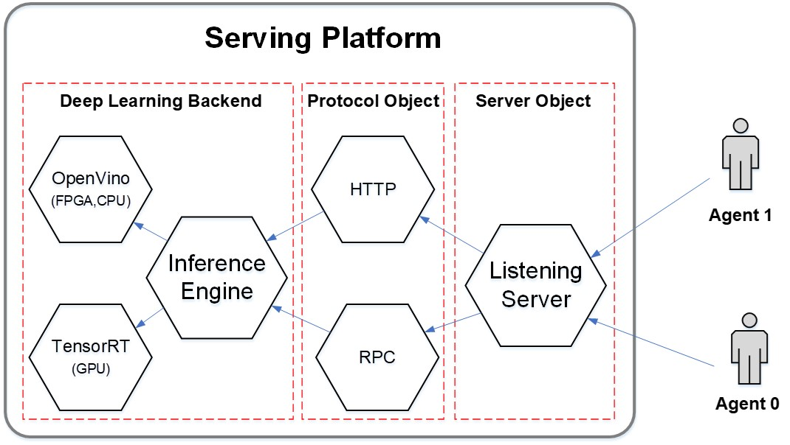
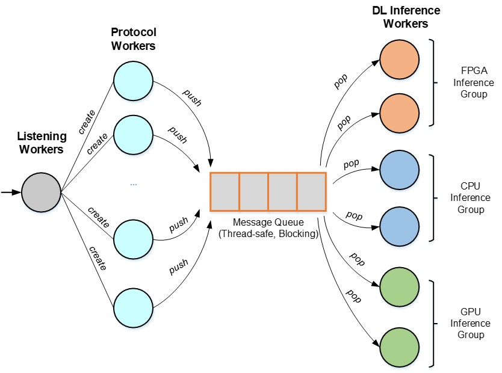
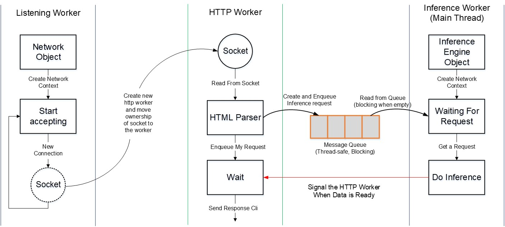

# Server Architecture

The basic components of the server are:

- Server object which listening for incoming requests

- Protocol object which handle the message incoming messages

- The inference engine which implement the deep learning inference neural network

  

The server is thread-based: each object is running within it own thread. The implementation can be done as easy as normal synchronous server: we have one shared inference engine object, and for each new request, we create an inference context and launch the inference engine. As long as all context is thread-safe, there is no thing to worry and the deep learning framework (openvino, tensorrt) will handle the request properly. However, in my project, I use an Arria 10 development kit, which is not thread-safe (i.e. the hardware is not thread-safe and will crash the program if there are more than two thread trying to access it at the same time). Therefore, I developed the server in producer-consumer fashion: the are some dedicated threads that run the inference engine and they will get the job from a task queue, which will be populated by protocol threads.

  

While I developed the queue to deal with the FPGA, I found it work well for other devices, so I decided to use it as the default model for my server. The procedure of handling an incoming connection is as follow:

  

Currently, I assume all device run a same models, therefore they can get the job from a same queue. I also take some effort to make different queue for each device, so [they can run different models](/server/_experimental/st_server_reactor.cpp). However, I stopped it as it adds extra complexity to the architecture. If we want to make a complete serving platform that can serve different models on different devices, we can use this project as the back-end and write the other routines (scheduler, load-balancer) as front-end service.